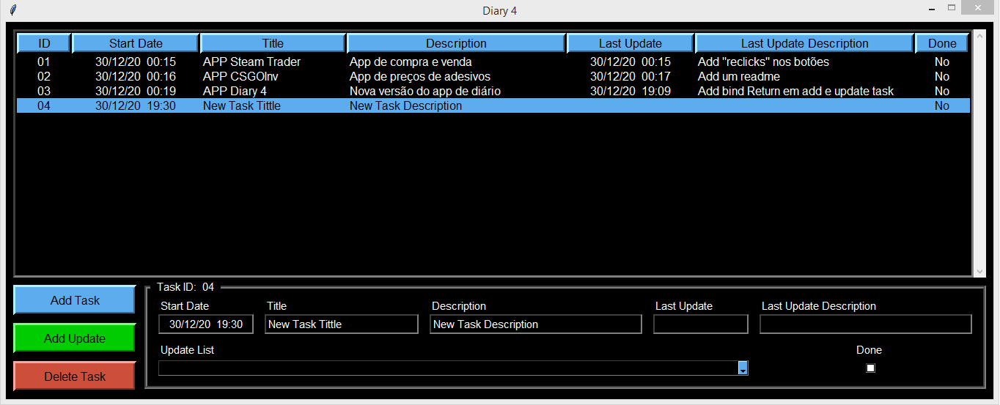
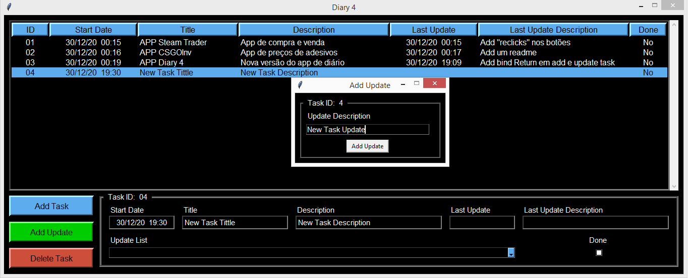
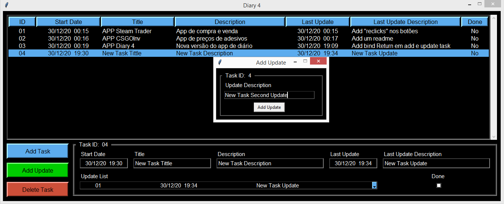

# Diary 4 Project
 
Desktop App to record and manage updates about my studies, projects and daily tasks.

* Adding a task:

<kbd></kbd>

* Task added:

<kbd></kbd>

* Adding an update to the new task:

<kbd></kbd>

* Update added:

<kbd></kbd>

* Adding a 2nd update to the new task:

<kbd></kbd>

* Second update added:
It is possible to consult the list of updates ordered by date of each task.

<kbd></kbd>
